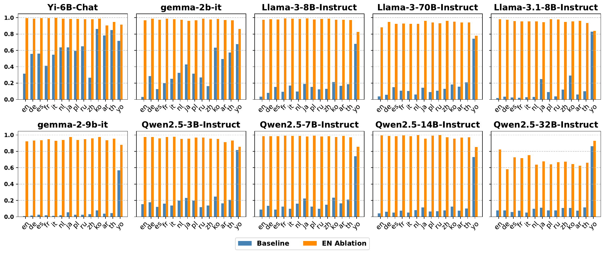

# Repo for Paper "Refusal Direction is Universal Across Safety-Aligned Languages"

## PolyRefuse

You can find the PolyRefuse dataset [here](PolyRefuse).

We include 14 languages in the PolyRefuse dataset: ar, de, en, es, fr, it, ja, ko, nl, pl, ru, th, zh, yo.

## Baseline vs English Refusal Vector Ablation

## Code Coming Soon!
